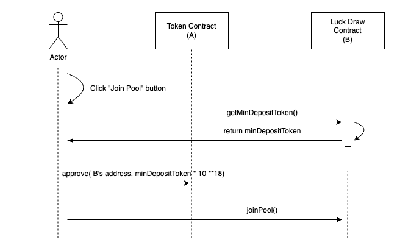
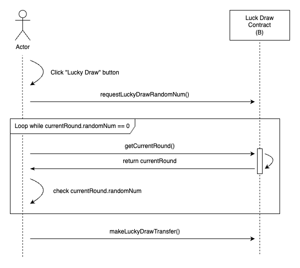

### dapp-lucky-draw

#### Main function

##### 1. getMinDepositToken()

Get minimum deposit token amount in current round

```solidity
function getMinDepositToken() external view returns (uint256)
```

##### 2. setMinDepositToken()

Set minimum deposit token amount in current round

```solidity
function setMinDepositToken(uint256 _minDepositToken) external onlyOwner
```

##### 3. getCurrentRound()

Get current round information

```solidity
function getCurrentRound() public view returns (Round memory)

struct Round {
    address winner;
    uint256 requestId;      // VRF request id
    uint256 randomNum;      // VRF random number
    uint256 luckyNum;       // winner index in address pool
    address[] addressPool;  // address pool
}
```

##### 4. getPoolBalance()

Get balance of the pool in current round 

```solidity
function getPoolBalance() public view returns (uint256)
```

##### 5. getRoundHistory()

Get round history

```solidity
function getRoundHistory() public view returns (Round[] memory)

struct Round {
    address winner;
    uint256 requestId;      // VRF request id
    uint256 randomNum;      // VRF random number
    uint256 luckyNum;       // winner index in address pool
    address[] addressPool;  // address pool
}
```

##### 6. joinPool()

Join current round and deposit tokens

```solidity
function joinPool() public
```

##### 7. requestLuckyDrawRandomNumber()

Request random number from Chainlink VRF

**Note:** Due to the implementation method of Chainlink VRF, the process of generating random numbers is asynchronous, and this function will not return the generated random number

```solidity
function requestLuckyDrawRandomNumber() public
```

##### 8. makeLuckyDrawTransfer()

After random number being generated, use this function to transfer tokens to the winner

```solidity
function makeLuckyDrawTransfer() public
```


#### Main logic

##### 1. Join pool



##### 2. Lucky draw



